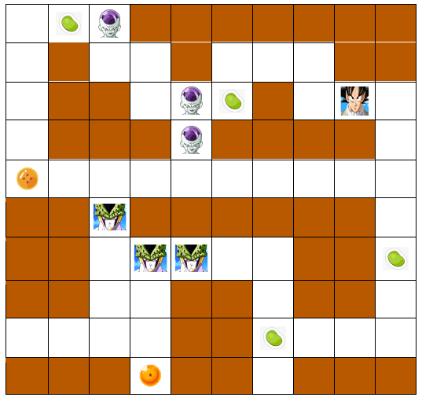

# GokuSmartIA

## Primer proyecto del curso Inteligencia Artificial.

Este proyecto consiste en el desarrollo de una aplicación que permite interactuar con un mundo determinado y aplicar algoritmos de búsqueda para encontrar soluciones. 

El objetivo de Goku es encontrar dos esferas del dragón en un espacio de 10x10
casillas, usando algoritmos de inteligencia artificial. En el ambiente hay casillas donde pueden haber
enemigos que afectan el bienestar de Goku, pero también se cuenta con semillas del ermitaño que lo
favorecen. Considere la siguiente abstracción del mundo representado por medio de una cuadrícula
de 10x10.

En cada búsqueda que emprenda, Goku podrá realizar desplazamientos simples tales como moverse
arriba, abajo, izquierda, y derecha. El costo de cada movimiento está dado de la siguiente manera:

  - 1 si es una casilla libre
  - 1 si es una semilla del ermitaño
  - 4 si es un freezer sin semilla
  - 1 si es un freezer con semilla
  - 7 si es un cell sin semilla
  - 1 si es un cell con semilla

Si Goku pasa por una casilla donde hay enemigo (cell o freezer) y no tiene semilla, dicho enemigo seguirá existiendo en esa casilla. En caso de que sí tenga semilla, el enemigo ya no aparecerá más en esa celda. Las semillas del ermitaño se pueden ir acumulando si se toman varias durante el recorrido. Cuando se llega a una casilla donde está cell o freezer y Goku tiene semilla, automáticamente la usará, es decir, no puede decidir si usa, o no, la semilla. La búsqueda termina cuando Goku encuentre las dos esferas.

La información del mundo se representa como una matriz de 10x10 en la que en cada celda se tiene
uno de los siguientes números:

- 0 si es una casilla libre
- 1 si es un muro
- 2 si el punto donde inicia Goku
- 3 si es un freezer
- 4 si es un cell
- 5 si es una semilla del ermitaño
- 6 si es una esfera del dragón

A continuación, se detallan las principales características y funcionalidades de la aplicación:

  - Ingreso de datos: La aplicación permite ingresar los datos del mundo mediante un archivo de texto que sigue las convenciones especificadas previamente.

  - Representación gráfica: El mundo del agente se despliega de manera gráfica, mostrando su estado inicial tal como se lee del archivo.

  - Selección del algoritmo de búsqueda: Se puede elegir entre dos tipos de algoritmos de búsqueda: "No informada" e "Informada".

    - Si se selecciona la búsqueda "No informada", se puede optar por los algoritmos de "Amplitud", "Costo uniforme" y "Profundidad evitando ciclos".

    - Si se selecciona la búsqueda "Informada", se puede optar por los algoritmos "Avara" y "A*".

  - Animación de la solución: Después de aplicar un algoritmo, se muestra una animación en la interfaz gráfica que representa los movimientos realizados por el agente para llegar a la solución.

  - Generación de reporte: Tras aplicar un algoritmo, se muestra un reporte que incluye la cantidad de nodos expandidos, la profundidad del árbol y el tiempo de cómputo. En el caso de los algoritmos de costo y A*, también se muestra el costo de la solución encontrada.

## Ejecución del proyecto

1 Para cargar un nuevo archivo txt se debe ingresar a la clase llamada "Archivo" de la carpeta "Model", buscar la función "abrirArchivo" y en la siguiente línea reemplazar el nombre `BufferedReader lector = new BufferedReader(new FileReader("nombre.txt"))` por el nombre del archivo que se desea cargar.

  Ejemplo:

  `BufferedReader lector = new BufferedReader(new FileReader("Prueba1.txt")); `

  Nota: El archivo txt debe estar en la misma carpeta del proyecto.

2 Ejecutar de nuevo el proyecto